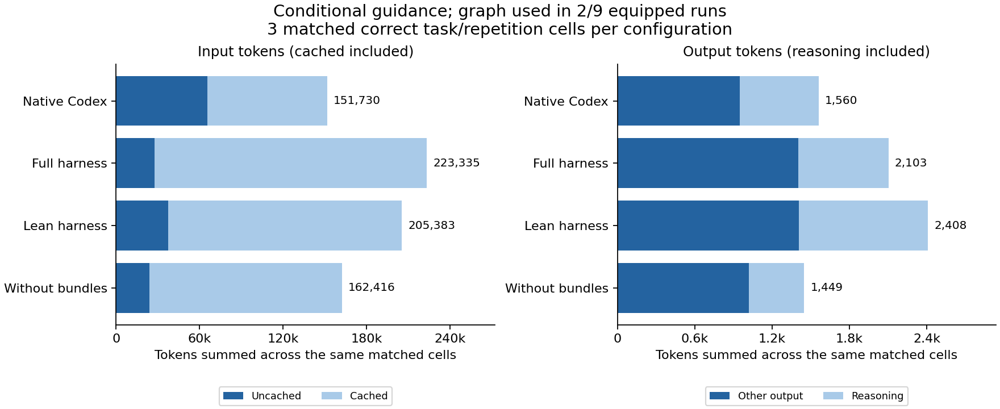

# GraphHarness does not yet have demonstrated Codex token savings

We ran **36 real Codex invocations** across two registered experiments, plus four
unscored integration calibrations. All 36 produced task-correct results; **35 are
valid measurements** after independent transcript review. One native repair run
wrote a class file outside its permitted workspace and was excluded from savings
comparisons, with its result and usage retained.

The tests used Codex CLI 0.154.0, configured `gpt-5.6-terra` with medium reasoning,
three small generated tasks, fixed prompts and independently executed evaluators.
The 12 benchmark unit tests also pass. The product and measured runner/evaluator
bytes remained unchanged throughout both experiments. Nothing was pushed.

## What the ablations established

**Offering tools was insufficient.** In the original 24-run experiment, Codex used
GraphHarness retrieval in **0 of 18 MCP-equipped runs**. All configurations could
use efficient native shell reads and did so. Some paired input/output numbers were
lower with the tools installed, but none of those differences came from executing
graph retrieval. They do not establish a retrieval or bundle benefit. There were
only two repetitions per task, with substantial variation. See every run and the
excluded case in the [availability report](availability/REPORT.md).

**Conditional guidance was also unreliable.** The separately registered 12-run
follow-up asked for bundle-first inspection, or search/source-first when bundles
were unavailable. Only **2 of 9 MCP-equipped runs** followed that route, and both
subsequently read source through shell. The following totals cover the same three
correct tasks per configuration; they are descriptive observations, not estimated
causal effects of individual features.

| Configuration | Input tokens | Cached input | Uncached input | Output tokens | MCP retrieval used |
| --- | ---: | ---: | ---: | ---: | ---: |
| Native Codex | 151,730 | 86,272 | 65,458 | 1,560 | — |
| Full harness | 223,335 | 195,840 | 27,495 | 2,103 | 1/3 |
| Lean navigation tools | 205,383 | 167,936 | 37,447 | 2,408 | 1/3 |
| Lean without bundles | 162,416 | 138,496 | 23,920 | 1,449 | 0/3 |

Input includes cached input; output includes reasoning. Full-harness totals were
47.2% higher for input and 34.8% higher for output than native in this follow-up.
Uncached input was lower, so these results must not be turned into a dollar-cost or
subscription-quota claim. Provider caching was not controlled. The smaller tool
sets were not consistently better, and the no-bundle configuration never exercised
its graph tools. We therefore cannot isolate a schema-size or bundle-content effect.

The [guided report](guided/REPORT.md) includes individual cells, medians, ranges,
tool counts and all paired comparisons. The first experiment's plot likewise uses
only cells valid in all four configurations, avoiding unequal-denominator totals.

## Two observed retrieval failures

These are **all** the MCP-using scored runs, not selected examples:

1. **TypeScript/Python lookup, full harness:** the 1,800-budget context bundle
   returned `no_node_resolved` with zero source slices. A search for `payment` among
   functions returned zero results. Codex then used shell. The observed invocation
   consumed 72,637 input / 514 output tokens, versus 28,133 / 199 for native on the
   same task in that experiment.
2. **Java repair, lean harness:** the task explicitly named `CouponPolicy.discount`,
   but the bundle selected `CouponPolicy.<init>`. Its two source slices contained
   111 source characters. Codex then read the actual file through shell and fixed
   it. The invocation consumed 133,153 input / 1,850 output tokens, versus 71,198 /
   982 for native.

These single observations diagnose wrong/empty retrieval and extra work; they do
not quantify a general causal overhead. [Mechanism evidence](mechanisms.json)
binds the selected targets, notes and payload sizes to the actual transcript hashes.

Source inspection supplies a plausible explanation:

- [Task-to-node resolution](../../src/main/kotlin/graphharness/Analyzer.kt) first
  attempts edit-target resolution, then scans individual task terms for a method,
  taking the first match. The observed repair fallback matched the class term and
  selected its constructor before reaching the requested method. The method-only
  fallback is also poorly suited to TypeScript/Python function tasks.
- [Bundle construction](../../src/main/kotlin/graphharness/Analyzer.kt) budgets
  using approximate character counts. Its metadata and source selection do not
  guarantee a compact or relevant model-visible response.
- [MCP bridge serialization](../../src/main/kotlin/graphharness/LiveBridge.kt)
  includes JSON in both text content and structured content. The direct stdio server
  does the same. This proves transport duplication, **not** that Codex charges both
  copies as input. Client serialization needs a separate controlled test.

## Development priorities supported by this pilot

1. **Establish reliable tool routing.** Verify discovery and the actual first tool
   call. Prompting that mentions tool names conditionally is insufficient here.
   Evaluate an explicit integration workflow separately from freely offered tools.
2. **Fix task-to-symbol selection.** Resolve qualified identifiers before broad
   class matches, handle function kinds across supported languages, and expose
   ambiguity instead of choosing an unrelated constructor. First add independent
   regression cases, then test on new tasks so these pilot examples do not become
   the evidence for generalization.
3. **Measure compact responses and fewer round trips.** Compare equivalent evidence
   with reduced repeated metadata and deliberate batching. Preserve versions,
   provenance, ambiguity and truncation information. Verify what Codex actually
   receives before attributing tokens to text/structured duplication.
4. **Repeat on larger, unfamiliar repositories after those fixes.** Gate input and
   output savings on correctness, record cached input separately, keep failures,
   and reserve fresh tasks for confirmation. The browser and lease features are
   useful for different goals but this pilot does not test their token impact.

The recommendation is to prioritize routing and retrieval correctness before
claiming efficiency or investing in further graph presentation work. No product
optimization was mixed into these frozen measurements.

## Evidence limits and integrity

There are only two distinct source corpora: 129 Java lines and 180 TypeScript/Python
lines. Java reasoning and repair share source; the guided phase reuses these
development fixtures. No production-repository, large-repository, model-wide or
multi-agent efficiency claim follows. The model alias is configured, not provider
attested. The host filesystem was not sealed; independent transcript audits checked
access and retained the one exclusion. No prompt, task or evaluator was changed
during a frozen run set, and no completed trial was rerun to improve a result.

Protocols and reproduction commands are under
[benchmarks/token_ablation](../../benchmarks/token_ablation/README.md).
`frozen.json`, `runs.json`, `runs.csv`, `summary.json` and `regrade.json` preserve
versions, schedule, outcomes, token counts, receipt hashes and repeated evaluator
checks. Raw transcripts and authentication material remain private outside Git.

The local raw-evidence archive is `artifacts/token-ablation/2026-09-18/` (ignored
by Git). It includes transcripts, fixture workspaces and per-file archive digests;
daemon runtime directories and credentials were excluded. The
[independent final review](INDEPENDENT_REVIEW.md) found no blocking arithmetic or
interpretation issue and states exactly which checks it did and did not reproduce.
