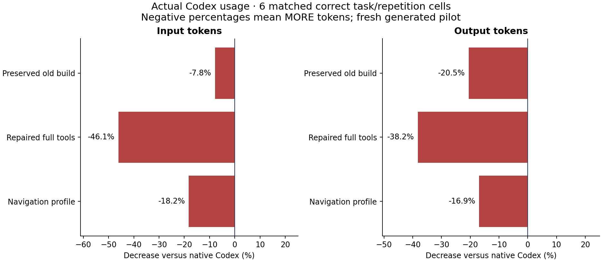

# Retrieval bugs fixed; token-efficiency target still unmet

We repaired confirmed lookup and integration problems, then ran **24 fresh scored
Codex trials** plus four unscored integration calibrations. All 24 were correct and
passed independent access review. The fixes did **not** demonstrate lower total
input or output tokens than native Codex.

These totals cover the same three generated tasks, two repetitions each, per arm:

| Configuration | Input tokens | Output tokens | Input versus native | Output versus native | Retrieval attempted |
| --- | ---: | ---: | ---: | ---: | ---: |
| Native Codex | 378,053 | 5,235 | baseline | baseline | — |
| Preserved old build | 407,515 | 6,310 | 7.8% increase | 20.5% increase | 0/6 |
| Repaired full tools + guidance | 552,264 | 7,233 | 46.1% increase | 38.2% increase | 6/6 |
| Repaired navigation profile + guidance | 446,923 | 6,120 | 18.2% increase | 16.9% increase | 6/6 |

Input includes cached input; output includes reasoning. Percentage decrease is
`100 × (native − treatment) / native`; negative values are increases. The compact
profile reduced totals relative to repaired full tools, but it did not beat native.
Against the old build, navigation used 9.7% more input and 3.0% less output. These
are descriptive pilot results, not isolated causal estimates of each feature.

## Confirmed causes and changes

1. **Wrong target selection.** A replay with the real Joern backend reproduced the
   old selection of `CouponPolicy.<init>` for a request naming `CouponPolicy.discount`.
   The fixed resolver returns the requested method. It prioritizes qualified symbols
   and file references, handles multiple explicit targets and languages, and exposes
   overload/basename ambiguity. Search now matches paths as well as names. It no
   longer silently substitutes an arbitrary entrypoint. The exact old behavior-only
   query remains unresolved: this is not semantic natural-language search.
2. **Hidden tools in the installed client's code mode.** A local mock-provider
   capture showed that GraphHarness names and initialization instructions were absent
   initially and appeared after `ALL_TOOLS` discovery. `codex-instructions` now prints
   an explicit workflow that discovers and invokes the bundle in one code call. Both
   repaired arms used retrieval in every scored run; the old arm used none.
3. **Duplicate result presentation.** The same no-model diagnostic showed both text
   and structured copies reaching context when the entire result was printed. The
   workflow emits `structuredContent ?? content` once. The MCP transport preserves
   both representations for compatibility. Actual projection compliance cannot be
   verified from the scored JSONL, which omits the code-mode wrapper script.
4. **Unnecessary interface and response metadata.** Optional `bridge --navigation`
   exposes four read tools rather than the sixteen available in the tested full
   daemon. It removes orientation/timing and selected node summaries while preserving
   source, versions, spans, relationships and caveats. The full bridge stays default.

See the [direct old/fixed replay](../../debug/retrieval-reproduction.json),
[installed-client diagnostic](../../debug/client-probe.json), and
[scored bundle observations](mechanisms.json). The mock uses fixed responses and
does not measure model tokens or establish production-provider behavior.

## Why the efficiency test still failed

All four mixed-language bundle attempts returned ambiguous candidates and **zero
source slices**. They added a lookup before ordinary inspection. The four Java
navigation bundles returned the correct entry method and a limited neighborhood;
every read-only retrieval run still proceeded to shell inspection. This supports
the explanation that the bundle did not replace enough of the existing workflow.

Repair bundles selected the requested method, and all repairs passed the independent
behavior/scope evaluator. Shell editing and testing after those bundles is expected;
its presence alone is not evidence of failed retrieval. Extra model/tool work and
stochastic execution choices still matter. Across arms, the audit observed blocked
JShell sockets and non-Git `git diff` failures. Those costs remain included. No
stderr approval rejection was observed in this follow-up; that does not mean every
tool succeeded. Per-request token attribution is unavailable.

**The registered continuation threshold failed:** at least 20% less input than
native, no output increase, full correctness and at least half the treatment runs
using retrieval. Do not recommend mandatory bundle-first use as a proven token
optimization. The profile remains optional and experimental. Further efficiency
work would need to replace native reads/round trips with sufficient context, and
avoid attempting structural lookup for tasks it cannot resolve. This cycle does
not establish that such a design will beat efficient native inspection.

## Verification and integrity

- **97 JVM tests passed**, including seven retrieval regressions and bridge/profile
  preservation checks; **23 benchmark tests passed**, including evidence mutations,
  wrong-answer/repair mutations, denominator checks, and failure retention.
- All 28 model invocations have bound independent access reviews; all 24 scored
  outcomes were re-executed by the evaluator and independently checked. No scored
  attempts were excluded or retried. The old distribution matched all 143 relevant
  installed-file hashes from the original experiment.
- The product, evaluator, prompts and schedules were frozen before trials. The exact
  printed guidance, its overhead, CLI native/launcher hashes, known host instruction/
  rule hashes and actual MCP contracts are recorded. Repaired arms receive guidance
  that native/legacy do not. Profile comparisons combine related changes.
- The fresh fixtures contain only two source corpora: 48 Java files/407 source lines
  and 40 TS/Python files/198 source lines. They are small synthetic development
  confirmation tasks, not production-repository generalization. The model alias is
  configured, provider caching is uncontrolled, and external runtime binaries are
  not comprehensively pinned. Actual engine/adapter metadata is retained.
- Three direct-replay observations from an ignored-directory setup mistake remain
  explicitly excluded. No scored model ran on an empty index; every indexed source
  count was checked. A test expectation about Java file nodes was corrected after an
  independent probe; product behavior was unchanged by that test correction.

The [full report](REPORT.md) preserves every run, paired percentage and failed gate.
[Independent review](INDEPENDENT_REVIEW.md) states its scope and runtime findings.
[Protocol and commands](../../benchmarks/token_followup/README.md) reproduce the
study. Raw transcripts and credentials are not committed; the ignored private archive
preserves raw evidence without daemon runtime credentials. Nothing was pushed.
