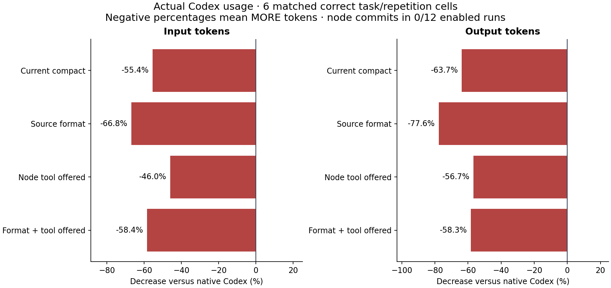

# Slim responses and node editing: measured outcome

The implementation is complete, but the token-reduction goal remains unmet.
All 30 scored repairs were correct and access-valid. Every graph configuration
used more aggregate input and output than native Codex on the same six
task/repetition cells. None met the registered 20% input-reduction threshold.

| Configuration | Input increase vs native | Output increase vs native |
| --- | ---: | ---: |
| Current compact control | 55.4% | 63.7% |
| Source-centered format | 66.8% | 77.6% |
| Node editor available | 46.0% | 56.7% |
| Format + node editor available | 58.4% | 58.3% |

These are actual terminal Codex usage counters. Input includes cached input;
output includes reasoning. The percentage increase is `(treatment − native) /
native × 100`. The generated [report](REPORT.md) and [chart](token-change.svg)
express the same values as negative percentage decreases. Native totals were
542,445 input and 6,721 output tokens. All attempts, paired results, cache subsets
and failures remain in [runs.csv](runs.csv), [runs.json](runs.json) and
[summary.json](summary.json).

## What was implemented

`--response-format source-v1` groups bundle source under its node and inherits
identical metadata. It preserves source text, missing/null fields, source order,
ambiguity, provenance and caveats without changing retrieval selection or budget.
It changes context bundles only. The original response format stays the default.

`--node-edits` adds `replace_node_body` to the navigation bridge when the daemon
has writes enabled. It validates fresh node/snapshot/hash inputs, prepares a
parser-checked Java method-body replacement, acquires a brief file reservation,
commits through the existing guarded path and releases only its own reservation.
Existing reservations, including the caller's, remain untouched. It returns a
small commit receipt and retains the preview for the UI. Syntax checks are not
project tests; unsupported targets fail closed. See the
[setup and restrictions](../../docs/codex-navigation.md).

The full build passed 122 JVM tests; the benchmark passed 36 tests. Evidence and
retained artifact identities are in [checks.json](checks.json). Product code was
frozen at `70aa722`; the corrected evaluator/run protocol at `7abd0f6`. No product
tuning followed inspection of scored outcomes. Interface implementation, edit
implementation, fresh evaluation fixtures and independent audit were delegated
separately; the integrator owned the runner, review, build and Git index.

## What the ablations establish

Changing only the format increased input by 7.3% and output by 8.5% against the
compact control. With the node tool available, changing the format increased
input by 8.4% and output by 1.0%. Smaller response encoding did not translate into
lower total usage in this pilot. These are observed aggregate differences, not
precise population effects: there are only three tasks and two repetitions.

Offering node editing reduced input by 6.1% and output by 4.3% relative to compact,
and by 5.1%/10.9% relative to the new format. **No scored agent called the node
editor in any of the 12 enabled runs.** Those differences therefore cannot be
credited to performing edits through graph nodes. Actual node-writing efficiency
remains unmeasured. The guided calibration did execute successful node writes;
that proves the route works for its simple target, not adoption or general support.

All 24 graph-equipped runs attempted retrieval. They made 24–27 shell calls per
six-run configuration, plus 6–8 bundle calls, versus 20 shell calls for native.
All eight overload runs returned ambiguous candidate sets without source and
used native inspection. Returned bundle lines also appeared in later shell output
in 12 of 24 graph runs, including every long-method run. This is literal overlap,
not proof that every reread was unnecessary. These observations are consistent
with extra interaction and inspection outweighing payload savings; they do not
isolate provider token attribution or reveal the model's reasoning.

A separate replay of six earlier development responses reproduced exact JSON
round trips and reduced serialized UTF-8 bytes from 21,862 to 20,016: **8.44%**.
The two empty-source responses grew by 5.27%. This
[byte diagnostic](format-development.json) is not a model-token measurement or
an independent efficiency result.

## A material support limitation found after scoring

An independent, non-model [eligibility probe](edit-eligibility.json) used fresh
fixture copies and requested plans with the unchanged original method bodies.
The short primitive-parameter target obtained a plan. The long and overloaded
targets both returned `target_not_found` under the frozen Joern backend despite
current node/snapshot/file hashes and bodies below the argument-size limit.
No files were changed and no edit was applied.

The inherited parser matcher compares type spellings after removing whitespace;
Joern uses qualified custom parameter types while these declarations use simple
names. This restriction predates the new one-call wrapper and affects its shared
preparation path. It is a confirmed eligibility limitation, not an observed scored
tool rejection or an explanation of model intent. The scored availability
comparison remains intact, but this study cannot establish node-edit efficiency
across the intended target families. Calibration should have checked target
eligibility under the actual backend before drawing any such conclusion.

Keep both options experimental. The next development priorities are explicit
overload-to-source navigation, safe agreement between backend and compiler type
identities, and a discoverable editing route. Validate those on development tasks,
then preregister fresh tasks with eligibility checks before another efficiency
study. Do not force or filter this dataset after seeing the results.

## Integrity and limits

The [registered protocol](../../benchmarks/token_interface/PROTOCOL.md) randomized
30 sequential invocations on one connected 24-file, 12,834-byte Java corpus.
Fresh task answers were separated from product development until product freeze.
All graph arms received identical integration guidance; native received no graph
guidance. The comparison with native includes that overhead. This compact control
also has updated guidance and different tasks from earlier studies, so cross-study
percentage changes are not a controlled regression comparison.

The original four-calibration attempt is preserved: an exact-text checker falsely
rejected an equivalent nested-block repair, and another calibration violated the
scratch-output rule. Before any scored run, behavioral/scope grading replaced the
text checker and the existing scratch instruction was clarified equally for all
arms. The product, scored evaluator, seed and metrics stayed unchanged. Five new
calibrations passed. All nine calibrations are excluded from scored totals;
[calibration-history.json](calibration-history.json) retains their provenance.

Every scored outcome was recomputed, raw terminal counters and bindings checked,
and commands, writes, source responses and stderr independently audited. No
observed out-of-scope access or evaluator exploitation was found. There were no
retries, exclusions, missing usage counters, timeouts or infrastructure failures.
Observed tool errors remain in costs; zero stderr approval rejections does not
mean zero failed commands. Private evidence is archived with rehashed manifests,
excluding daemon runtime credentials. The external evaluator is not an OS sandbox;
review of actual edits and commands supplements its behavior/scope checks.

Provider cache state is uncontrolled. Host configuration isolation is incomplete;
known instruction hashes are retained, but full effective context and external
runtimes are not completely pinned. Code-mode wrapper output is absent from CLI
JSONL, so single-result projection compliance is unobserved. The configured model
was `gpt-5.6-terra`, medium reasoning, on Codex CLI 0.154.0; provider identity is
not attested. This small synthetic study supports neither billing claims nor
general production-efficiency claims. See the
[independent review](INDEPENDENT_REVIEW.md) for the audit and remaining limits.
