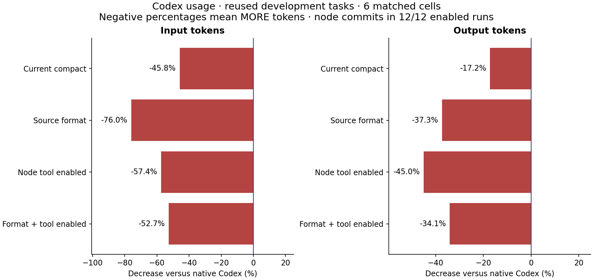

# Node editing fixed and used; token-saving goal still unmet

The repaired Java matcher and explicit Codex guidance made node editing work on
all three target families. All **12/12 node-enabled runs** used it, making **14
successful commits** with no rejected node calls or native production-edit
fallback. All **30/30 repairs** passed independent behavior, edit-scope and access
checks. Every graph configuration still used more total input and output than
native Codex on the same six task/repetition cells.

| Configuration | Input tokens | Output tokens | Input increase vs native | Output increase vs native |
| --- | ---: | ---: | ---: | ---: |
| Native Codex | 579,494 | 9,165 | — | — |
| Current compact | 845,138 | 10,740 | 45.8% | 17.2% |
| Source-centered format | 1,019,774 | 12,587 | 76.0% | 37.3% |
| Node editing | 912,212 | 13,290 | 57.4% | 45.0% |
| Format + node editing | 884,722 | 12,287 | 52.7% | 34.1% |

Increase is `(treatment − native) / native × 100`. Input includes cached input;
output includes reasoning. These are whole-task CLI counters, not response bytes
or independently reconciled billing. [REPORT.md](REPORT.md) uses the complementary
percentage-decrease convention, so its negative values mean increased usage.
All 30 attempts are retained, with no retries, exclusions, missing counters,
timeouts or infrastructure failures. No arm met the registered 20% input-reduction
and no-output-increase gate.

## What was fixed and verified

Joern's qualified Java parameter names previously disagreed with compiler source
spellings. The shared matcher now resolves retained declarations and explicit
imports while preserving full package identity, array rank, generic structure,
overload uniqueness, owner/name/line checks, source hashes and edit boundaries.
Unknown resolution fails closed; this does not establish universal Java edit
support. Declaration inventory limits and unresolved inherited/imported forms
remain documented in [the navigation guide](../../docs/codex-navigation.md).

The emitted guidance now discovers the node editor alongside retrieval, selects
overloads by an actual `node_id` argument, and directs supported advertised edits
through the tool with fresh source credentials. Native fallback remains available.
This is explicit guided use; the earlier study merely offered the editor.

Before any model launch, separate fresh copies of **all three targets** passed
original-body planning and real Joern-backed node repairs, followed by external
behavior/scope grading. Five separate model calibrations also passed their route,
instrumentation and independent access gates. These checks and their known repair
fixtures are excluded from scored totals and stayed outside scored workspaces.
See [preflight.json](preflight.json) and [checks.json](checks.json).

The full product build passed **132 JVM tests**, with zero failures/errors/skips;
**six executable guidance tests** and **42 benchmark tests** passed. The 19 collector
tests passed again after report metadata changed. Product commits are `9ce342a`
(matcher) and `346d71b` (guidance); evaluation commit is `4751583`. All 147 installed
files were frozen before trials. Earlier studies remain unchanged.

## What the traces explain

The [independent audit](INDEPENDENT_REVIEW.md) and
[mechanism evidence](mechanism-evidence.json) show observed work, without assigning
an unmeasured causal share of tokens to each action:

| Configuration | Completed shell calls | Context bundles | Node commits | Runs using nodes |
| --- | ---: | ---: | ---: | ---: |
| Native | 22 | 0 | 0 | 0/6 |
| Compact | 22 | 8 | 0 | 0/6 |
| Source format | 28 | 7 | 0 | 0/6 |
| Node editing | 22 | 10 | 8 | 6/6 |
| Combined | 22 | 8 | 6 | 6/6 |

Node editing replaced native production writes, but both enabled arms still made
22 shell calls for inspection, validation and related work, the same aggregate
count as native. Graph calls were additional observed interactions. These counts
omit code-mode wrapper/discovery calls and are not a count of model turns.

Every node edit sends a complete replacement body. The node-only arm supplied
5,899 UTF-8 body bytes across eight calls; combined supplied 4,908 across six.
Native production diffs were localized. Native patch payloads are absent from
the recorded file-change events, so an equal-basis generated-byte comparison is
unavailable. Body bytes are not token counts.

Both overloaded-method node-only runs made a second commit solely to correct
indentation after their first edits had already passed behavior checks. Those
extra reads, writes and tests remain included. One long-method node-only result
retained excess indentation inside the allowed body. Behavioral correctness does
not imply satisfactory formatting; this interface limitation remains unresolved.

All scored runs eventually executed focused Java probes. Some first probes had
incorrect expectations or constructor arguments and needed correction. Git errors
on nonrepository fixtures, JShell sandbox restrictions, missing-path searches and
expected no-match checks also occurred. A zero stderr-approval-rejection count
does not mean every command succeeded. The detailed audit distinguishes these
outcomes and does not call a corrected scratch probe a failed production repair.

## What the ablations support

Adding node editing to compact increased input/output by **7.9%/23.7%**. Adding it
to the source-format arm reduced input/output by **13.2%/2.4%**. Changing the format
alone increased input/output by **20.7%/17.2%** without nodes, but reduced them by
**3.0%/7.5%** when nodes were enabled. These mixed small-sample effects do not
support a general claim that either option saves tokens. None beat native.

Compact and combined used **14.9% and 25.3% less uncached input** than native,
respectively. That counterevidence is retained, but cache state was uncontrolled;
it neither meets the total-input goal nor establishes lower billing. All subsets,
individual runs and 48 paired comparisons are in [summary.json](summary.json),
[runs.csv](runs.csv) and [REPORT.md](REPORT.md).

## Limits and decision

This is a **development rerun of three previously seen synthetic tasks**, two
repetitions each on one 24-file, 307-line Java corpus. Known results informed the
fixes. The new guidance and an equal compilation/behavior-check instruction for
every arm were frozen before launch. Every control was rerun contemporaneously.
This is neither an unseen-task evaluation nor an isolated causal estimate of the
parser fix. The change from 0/12 to 12/12 node use is descriptive; it does not
separate the effects of guidance and eligibility repair.

The configured model was `gpt-5.6-terra`, medium reasoning, through CLI 0.154.0;
provider identity was not independently attested. Complete host context, cache
state and all external runtimes were not controlled. Independent review found no
observed evaluator access or exploitation, regraded every repair, reconciled all
terminal counters and comparisons, checked 47 returned source slices and
reconstructed all 14 node commits. This audit does not prove the absence of every
possible leakage path. Private raw evidence is archived with rehashed manifests;
public records omit prompts, credentials and machine paths.

The eligibility/adoption repair succeeded for these targets. The requested
whole-task token reduction did not. Keep both options experimental and make no
token-saving claim. Further evaluation needs a changed, falsifiable workflow
hypothesis and independent tasks; repeating this development set until a favorable
score appears would not establish generalization.
